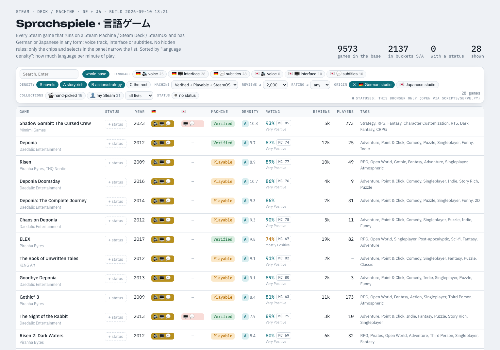
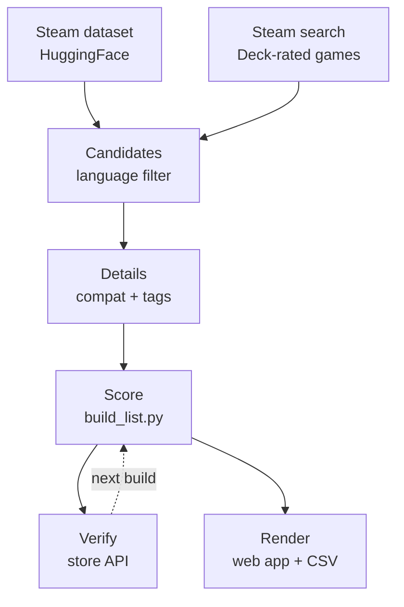

<h1 align="center">Sprachspiele · 言語ゲーム</h1>
<p align="center"><b>Steam's catalogue, filtered to games worth playing to learn German or Japanese</b></p>
<p align="center">
  
  
  
</p>

<p align="center"></p>

Steam calls a game "German-supported" whether that means a full voice cast or a
translated menu. This pipeline joins Steam's data with Valve's hardware reports, scores
each game by how much language the player must process, and renders a single-file web
app. The dataset and the page are not committed; `make all` rebuilds them.

## What it does

- **Language rule.** Passes only games with a German or Japanese voice track, or with no voice track and German or Japanese text.
- **Language-intensity score.** Steam user tags predict words per minute; every game lands in bucket S, A, B or C.
- **Hardware compatibility.** Valve's Deck, SteamOS and Steam Machine verdicts per game, with the reasons behind a Playable rating.
- **Live verification.** The top candidates are re-checked against the store API, which fixes Steam's missing audio flags on older titles.
- **Origin detection.** Flags German, Austrian, Swiss and Japanese studios, where the target language is the original rather than a dub.
- **Single-file web app.** Faceted filtering, tag include and exclude, search and per-game status tracking, client-side over ~9.5k rows.

## Quick start

```sh
make all                       # full rebuild; downloads the 192 MB dataset once
make serve                     # local site on http://localhost:8777/ with statuses
make CATALOGUE.md index.html   # re-render after a script change
make data/langflags.json       # per-language flags: run after a build, rebuild once
```

Requires [`uv`](https://docs.astral.sh/uv/) and Python 3.12+; pandas and pyarrow are
pulled in per invocation. A rebuild from empty caches takes about two hours, later runs
only fetch what is missing.

## How it works



Every stage is a Makefile target with real file dependencies, so `make all` rebuilds only
what changed. The rate-limited fetches (Steam search, compatibility reports, SteamSpy,
the store API) write resumable caches into `data/`; later runs fetch only what is missing.

`build_list.py` joins everything, applies the language rule and scores each game from its
tags; `make_html.py` and `make_catalogue.py` render the result.

<details><summary><b>The language rule and verification</b></summary>

| Game has… | Passes if… |
|---|---|
| a voice track | German or Japanese is a **full-audio** language |
| no voice track | German or Japanese is a text language |

English voice with German subtitles fails: the reader hears English and takes the
shortcut. Such games stay in the data flagged `lang_ok=false` and only appear in an
appendix (`games_text_only.csv`).

Steam often omits the full-audio asterisk on older titles, so the 2,154 highest-ranked
candidates are re-fetched from the live store API (`verified=true` in the CSV), and
`IStoreBrowseService` adds separate interface / audio / subtitle flags per language.

Explicitly adult games (Steam tags *Hentai* / *NSFW*) are dropped from every output.

</details>

<details><summary><b>The language-intensity score</b></summary>

`scripts/tagscore.py` weights Steam user tags in tiers, on the premise that tags predict
words per minute: Visual Novel, Interactive Fiction and Dialogue Heavy at the top, Story
Rich, JRPG and Point & Click below, negative weights for PvP, Racing or Bullet Hell.

| Bucket | Meaning |
|---|---|
| **S** | Reading or listening *is* the game: visual novels, interactive fiction |
| **A** | Story-rich RPGs and adventures |
| **B** | Narrative action / strategy: less language per minute, but dubbed |
| **C** | Language barely used, never listed |

The final rank combines the tag score with the number and share of positive reviews.

</details>

<details><summary><b>Hardware compatibility</b></summary>

`ajaxgetdeckappcompatibilityreport` returns Valve's Deck, SteamOS and Steam Machine
verdicts per app. Every Deck Verified title counts as Steam Machine Verified, so the
pipeline keeps the best of the three plus Valve's reasons (launcher, anti-cheat,
first-run internet, performance) as a note.

| Status | Meaning |
|---|---|
| Verified | Runs as-is on a Steam Machine or Deck |
| Playable | Runs with the caveats listed in the note |
| SteamOS | Only the SteamOS Compatible flag is set |
| Unsupported | Does not run under SteamOS |

</details>

## Data files

All of these live in the git-ignored `data/`; *input* files are curated or exported once.

| File | Kind | What |
|---|---|---|
| `games.csv` | output | The deliverable: filtered, scored games |
| `games_text_only.csv` | output | Appendix: subtitle-only games |
| `games_scored.csv` | output | All ~40k scored rows, source of both renderers |
| `steam_lang.parquet` | cache | Slimmed HuggingFace dataset |
| `steam_deck_search.json` | cache | Steam search crawl: Deck-rated games, top tags |
| `details*.json` | cache | Compat report + SteamSpy tags per candidate |
| `langflags.json` | cache | Per-language UI / audio / subtitle flags |
| `verified_langs.json` | cache | Live store-API languages, top candidates |
| `steam_tags.json` | input | Steam tag id → name |
| `picked.json` | input | Hand-picked games, shown regardless of filters |
| `steam_account.json` | input | Optional export of owned / wishlisted app ids |
| `status.json`, `prefs.json` | state | Written by `serve.py`: statuses, UI preferences |

## Configuration

| Variable | Meaning |
|---|---|
| `SCRATCH` | Makefile: download directory, default `/tmp/games-scratch` |
| `PORT` | `serve.py` env: local site port, default `8777` |
| `AUTO_PUSH` | `serve.py` env: `1` pushes after each status commit |
| `DETAILS_OUT` | `fetch_details.py` env: output file for one fetch batch |

## Project layout

```
Makefile                 the pipeline: every stage, its inputs and its cost
scripts/
  slim_dataset.py        HuggingFace parquet -> languages, reviews, owners
  crawl_steam_search.py  Steam search crawl: every Deck-rated game + top tags
  candidates.py          language filter + review threshold -> app-id lists
  fetch_details.py       compat report + SteamSpy tags per app (resumable)
  fetch_langflags.py     per-language UI / audio / subtitle flags
  verify_languages.py    re-check languages against the live store API
  tagscore.py            tag -> language-intensity model, adult exclusion
  build_list.py          join, score, emit games*.csv
  make_html.py           -> index.html      make_catalogue.py -> CATALOGUE.md
  serve.py               local server: index.html + status / prefs API
docs/webapp.png          screenshot of the web app
data/                    generated caches and outputs (git-ignored)
```

## Development

`python3 -m py_compile scripts/*.py` checks syntax, `uvx ruff check scripts` lints.
`fetch_details.py` rewrites its whole output file, so never run two instances against
the same `DETAILS_OUT`; all fetchers are resumable and skip ids already in their output.

## License

[MIT](LICENSE). Game metadata belongs to Valve and the respective publishers.
